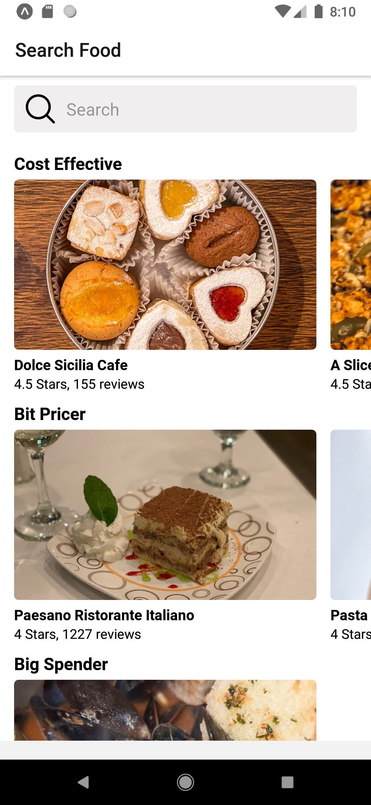
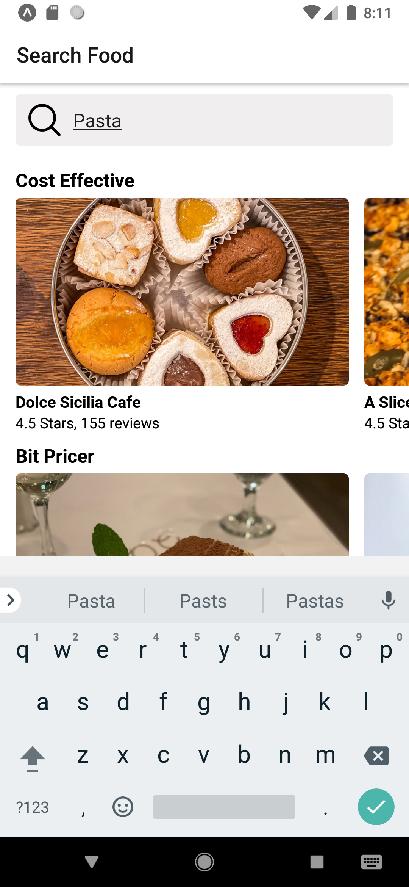
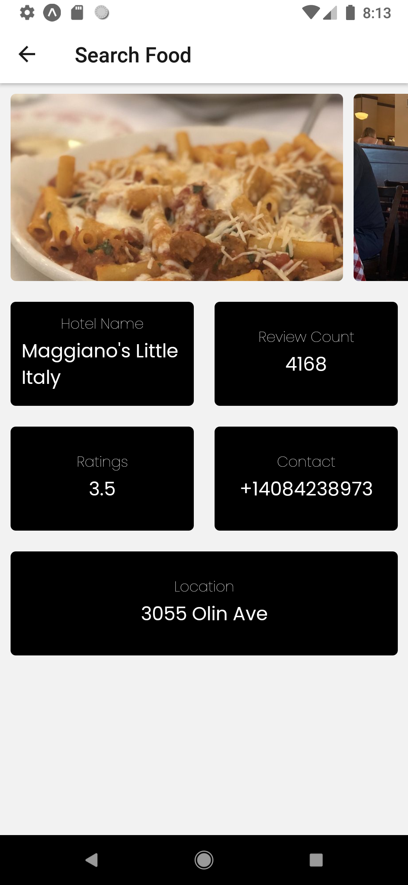

# Food Search App

<a name="readme-top"></a>

<details>
  <summary>Table of Contents</summary>
  <ol>
    <li>
      <a href="#about-the-project">About The Project</a>
      <ul>
        <li><a href="#built-with">Built With</a></li>
      </ul>
    </li>
    <li>
      <a href="#getting-started">Getting Started</a>
      <ul>
        <li><a href="#prerequisites">Prerequisites</a></li>
        <li><a href="#installation">Installation</a></li>
      </ul>
    </li>
    <li><a href="#screenshots">ScreenShots</a></li>
    <li><a href="#contact">Contact</a></li>
  </ol>
</details>


## About The Project

Well! we all love to eat food, especially food from our favorite restaurant but even food from our favorite restaurant might get boring someday and that’s why we are always looking for new places to dine in but who has the time right? I am pretty sure everyone is busy with their work or jobs. Keeping those things in mind I tried to build a simple app to search for places serving your favorite food in your city. Now you can search for the restaurants serving the food you are craving with their ratings, reviews, contact, and address all in the palm of your hand. So that you can go to a restaurant which fits your need ensuring you have a great time.

<p align="center">
  
</p>

<p align="right">(<a href="#readme-top">back to top</a>)</p>

## Built with
<p align="center">
  
</p>

<ul>
  <li>I built this app using react native expo cli</li>
  <li>Used yelp fusion API for all the restaurant data in JSON format.</li>
  <li>Used react native hooks such as useState and useEffect.</li>
  <li>For react navigation I used react navigation Version 4</li>
</ul>  

<p align="right">(<a href="#readme-top">back to top</a>)</p>

## Getting Started

## Prerequisites

* npm
```sh
  npm install -g npm
```
* React navigation V4
  1. Install react navigation
  ```sh
    npm install react-navigation
  ```
  2. Install Dependencies
  ```sh
    npm install react-navigation
  ```
  3. Install React Navigation Stack
  ```sh
    npm install react-navigation-stack
  ```
<p align="right">(<a href="#readme-top">back to top</a>)</p>

## Installation
1. Get your free API from [https://fusion.yelp.com/](https://fusion.yelp.com/)
2. Clone a repo
```sh
  https://github.com/prajesh9921/Food-App-.git
```
3. Make sure `npm` is installed
4. Open terminal in your project directory.
5. Start your project using 
```sh
  npm start
````
5. Install expo app in your phone 
6. Scan the QR code from your app and app should be up and runnig.

<p align="right">(<a href="#readme-top">back to top</a>)</p>

## ScreenShots

    

<p align="right">(<a href="#readme-top">back to top</a>)</p>

## Contact

<p align="center">Email: prajeshwork30@gmail.com</p>
<p align="center"><a href="https://www.linkedin.com/in/prajesh-gawhale-b0b9b3190/">Linkedin Link</a></p>
<p align="center"><a href="https://drive.google.com/file/d/1kymEkjjv3vk78CnyMv-xny3r408bZpvt/view?usp=share_link">Resume Link</a></p>  
<p align="center">Open for any Job / Internship opportunity</p>

